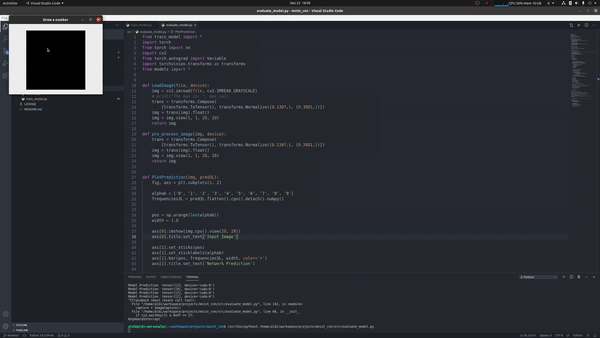
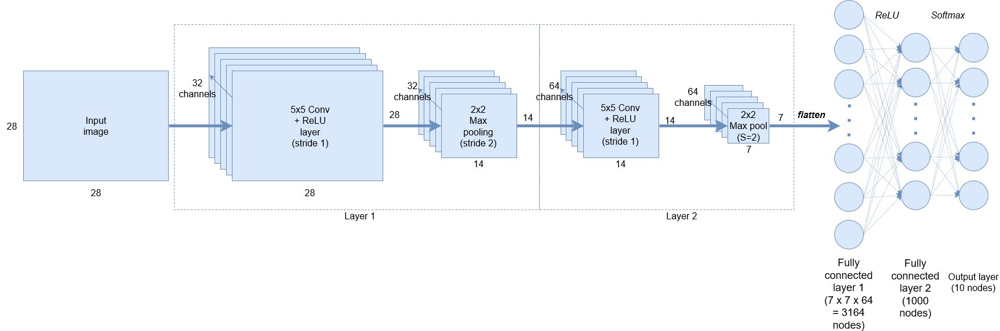

# MNIST Dataset with Convolutional Neural Networks


## Install
### Dependencies 
* torch
* cv2 
* numpy

### Usage
Train the model:

```bash
$ python3 src/train_model.py
```

Evaluate the model with mouse input:

```bash
$ python3 src/evaluate_model.py
```

## Description
### Models
There are 2 pretrained models saved in /src/models. The first model takes inspiration from this [tutorial](https://adventuresinmachinelearning.com/convolutional-neural-networks-tutorial-in-pytorch/), here is the model:





The second model adds a new convolutional layer. 

### Image Processing
When evaluation the model input mouse data, the image is take using opencv using a 500x500 canvas. Then the image is centered and finally is reduced to a 28x28 image (MNIST origianl image format). 


Performances seem to be better when the input images are well centered. 

### YouTube Develop Videos
Here is a link to the live process recorded on YouTube: 

<a href="http://www.youtube.com/watch?feature=player_embedded&v=GSZr759Y2hg
" target="_blank"></a>


